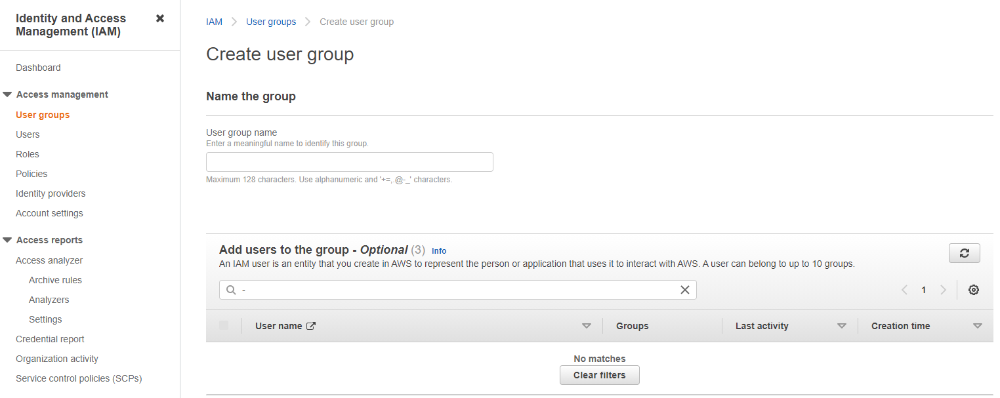
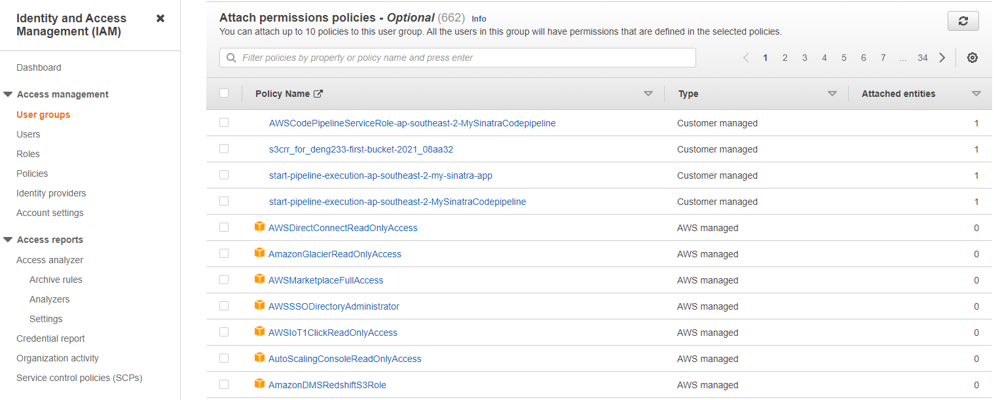
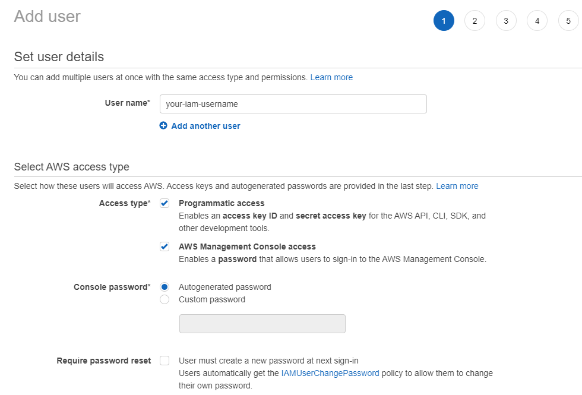
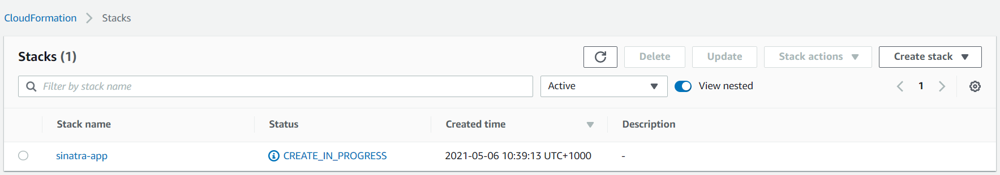
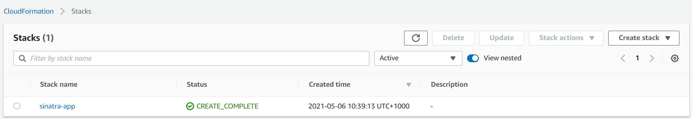
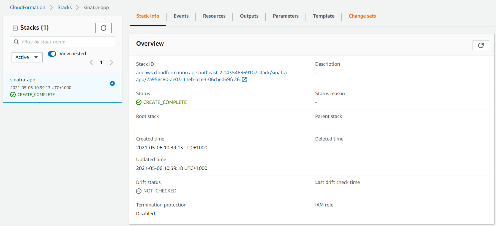
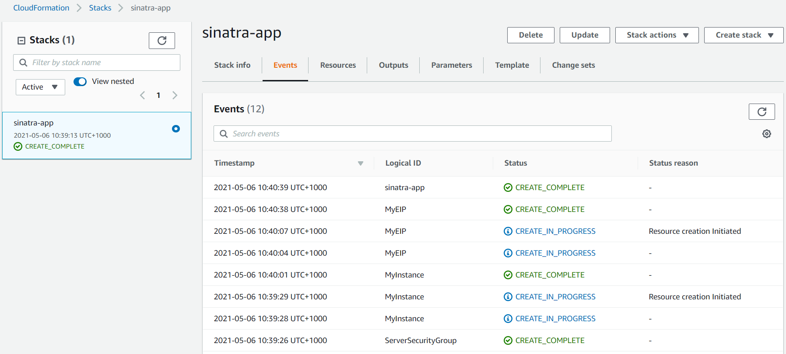
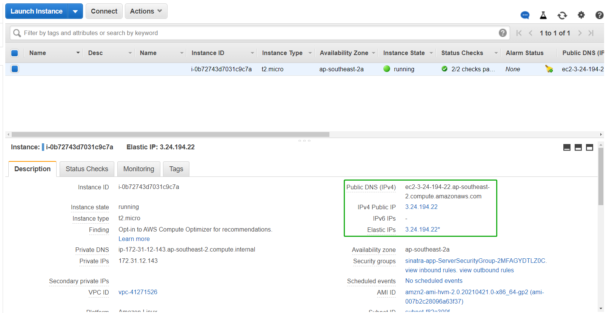

# Deploy Simple Sinatra App on AWS

## Preparations
#### 1. Create an AWS account with this link: [Sign up for AWS](https://portal.aws.amazon.com/billing/signup#/start)
#### 2. Install AWS CLI version 2
- **Linux**  
[Install the AWS CLI version 2 on Linux](https://docs.aws.amazon.com/cli/latest/userguide/install-cliv2-linux.html#cliv2-linux-install)

- **Windows**  
[Install the AWS CLI version 2 on Windows](https://docs.aws.amazon.com/cli/latest/userguide/install-cliv2-windows.html)

- **macOS**  
[Install the AWS CLI version 2 on macOS](https://docs.aws.amazon.com/cli/latest/userguide/install-cliv2-mac.html)

#### 3. Create a user group.
User group requires full access to following services:  
>**IAM, EC2, CloudFormation, S3, CloudWatch**

**NOTE:** User group can also be created and configured during iam user creation session.




#### 4.Create an IAM user with access key (console recommended), and add IAM user to user group 
[Create IAM users(console)](https://docs.aws.amazon.com/IAM/latest/UserGuide/id_users_create.html#id_users_create_console)



##### 5. Configure AWS CLI with acccess key   
[- Get Access Key](https://docs.aws.amazon.com/powershell/latest/userguide/pstools-appendix-sign-up.html)  
[- Configure Access Key](https://docs.aws.amazon.com/cli/latest/userguide/cli-configure-files.html)

**Note:** Configure aws Region to **ap-southeast-2**

**Hint:** Why create iam user and configure iam user access key?
> Root user access keys provide unrestricted access to your entire AWS account. If long-term access keys are needed, creating a new IAM user with limited permissions and generating access keys for that user instead is more recommended.   

> Learn more about: [Best practices for managing AWS access keys](https://docs.aws.amazon.com/general/latest/gr/aws-access-keys-best-practices.html)


## Deploy Sinatra Server
#### Download code from repo and go into the repo directory
```bash
git clone https://github.com/junyao-d/simple-sinatra-app-aws.git
cd simple-sinatra-app-aws/
```
#### Run following CloudFormation deploy command
###### In Windows PowerShell terminal
```
aws cloudformation deploy --template-file sinatra-server-launch.yaml --stack-name sinatra-app
```
###### In Linux/macOS/Windows Subsystem terminal
```bash
sh aws-stack-deploy.sh
```
---
**NOTE:**  
If you would like to run the command outside the source code directory, just put the path in front of the template yaml file.
```
--template-file /full_path/sinatra-server-launch.yaml
```
---
## Check your stack in the console
#### Go to Cloudformation > Stacks
###### Check stack deploy status: 


#### Go to sinatra-app
###### check stack info & events for deployment details



#### Go to EC2 > Instances


#### Copy public DNS or public IP Address to browser

---
Sinatra App is running!

## Summary

#### Assumption 
- Users have basic cloud knowledge
- Users have master/visa card and users are willing to pay
- Users do not have resistance to use Amazon services

#### Reason for choosing AWS
- Easy to deploy infrastructure with CloudFormation template (infrastructure as code)
- There is no need to install extra software such as virtual box and vm base images
- Easy to configure security rules
- Unified resources provision (Allow users to access the same resources such as VM images, load balancer)


#### Short comings and corresponding solutions
- Low availability and elasticity
  
Only one infrastructure(ec2 instance) is deployed, which may lead to single point of failure.

**Solution**:  
Launch infrastructure with an application load balancer and auto scaling group. Deploy at least one more ec2 instance in the target group if there is no auto scaling group. 

- Less secure network traffic  

Current application is deployed on port 80, so the application is accessed via http by default, which is less scure than https.

**Solution:**  
Configure Elastic Load Balancer to redirect http to https.  
[Redirect HTTP requests to HTTPS](https://aws.amazon.com/premiumsupport/knowledge-center/elb-redirect-http-to-https-using-alb/)


- Lack of monitoring actions/notification  

The deployment does not setup any monitoring mechanism. Failure of server may not be notified immediately if it happens.

**Solution:**   
Setup CloudWatch Alarms to trigger notification(such as SNS) for specific metrix or server failure. 

Configure eventbridge to take action when server encounters exceptions. 