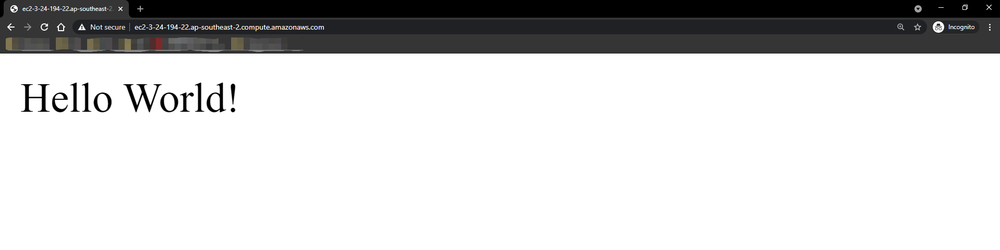

# Deploy Simple Sinatra App on AWS

## Preparations
#### 1. Create an AWS account with this link: [Sign up for AWS](https://portal.aws.amazon.com/billing/signup#/start)
#### 2. Install AWS CLI version 2
- **Linux**  
[Install the AWS CLI version 2 on Linux](https://docs.aws.amazon.com/cli/latest/userguide/install-cliv2-linux.html#cliv2-linux-install)

- **Windows**  
[Install the AWS CLI version 2 on Windows](https://docs.aws.amazon.com/cli/latest/userguide/install-cliv2-windows.html)

- **macOS**  
[Install the AWS CLI version 2 on macOS](https://docs.aws.amazon.com/cli/latest/userguide/install-cliv2-mac.html)

#### 3.Create an IAM user with access key (console recommended)  
[Create IAM users(console)](https://docs.aws.amazon.com/IAM/latest/UserGuide/id_users_create.html#id_users_create_console)


#### 4. Create a user group and add IAM user to user group. 
User group requires full access to following services:  
>**IAM, EC2, CloudFormation, S3, CloudWatch**
##### 5. Configure AWS CLI with acccess key   
[- Get Access Key](https://docs.aws.amazon.com/powershell/latest/userguide/pstools-appendix-sign-up.html)  
[- Configure Access Key](https://docs.aws.amazon.com/cli/latest/userguide/cli-configure-files.html)

## Deploy Sinatra Server
#### Download code from repo and go into the repo directory
```bash
git clone https://github.com/junyao-d/simple-sinatra-app-aws.git
cd simple-sinatra-app-aws/
```
#### Run following CloudFormation deploy command
###### In Windows PowerShell terminal
```
aws cloudformation deploy --template-file sinatra-server-launch.yaml --stack-name sinatra-app
```
###### In Linux/macOS/Windows Subsystem terminal
```bash
sh sinatra-deploy.sh
```
---
**NOTE:**  
If you would like to run the command outside the source code directory, just put the path in front of the template yaml file.
```
--template-file /full_path/sinatra-server-launch.yaml
```
---
## Check your stack in the console
#### Go to Cloudformation > Stacks
###### Check stack deploy status: 


#### Go to sinatra-app
###### check stack info & events for deployment details


#### Go to EC2 > Instances


#### Copy public DNS or public IP Address to browser

---
Sinatra App is running!

## Summary

#### Assumption 
Users have basic cloud knowledge

#### Reason for choosing AWS
- Easy to deploy infrastructure with CloudFormation template (infrastructure as code)
- Easy to configure security rules
- Unified resources provision (Allow users to access the same resources such as VM images, load balancer)


#### Short comings and corresponding solutions
- Low availability
  
Only one infrastructure(ec2 instance) is deployed, which may lead to single point of failure.

**Solution**:  
Launch infrastructure with an Elastic Load Balancer, deploy at least one more ec2 instance in the target group.

- Less secure network traffic  

Current application is deployed on port 80, so the application is accessed via http by default, which is less scure than https.

**Solution:**  
Configure Elastic Load Balancer to redirect http to https.  
[Redirect HTTP requests to HTTPS](https://aws.amazon.com/premiumsupport/knowledge-center/elb-redirect-http-to-https-using-alb/)